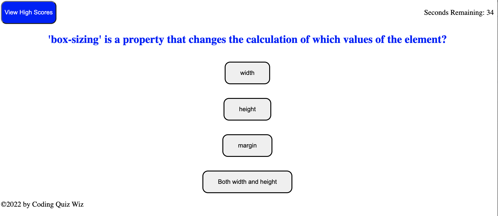
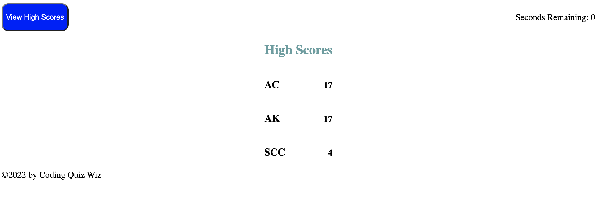

# Coding Quiz 

## Purpose 
Provide fellow classemates a quick quiz to test their understanding of some of the concepts we have coverd 

## Problems Solved 
I needed to give this quiz the ability to store highscores and append new ones. Figuring out the local storage was a great problem to solve. 

## Lessons Learend 
How to manipulate the DOM and how to make a webpage responsive 

## Built with 
* HTML 
* CSS 
* Javascript 

## Deployed 
https://clarkspencerc.github.io/coding-quiz/

## Screenshots 
Starting Screen
)

Question
)

Highscores

## Contribution 
Made by Spencer Clark 
Quiz questions came from different lesson quzies in class material 